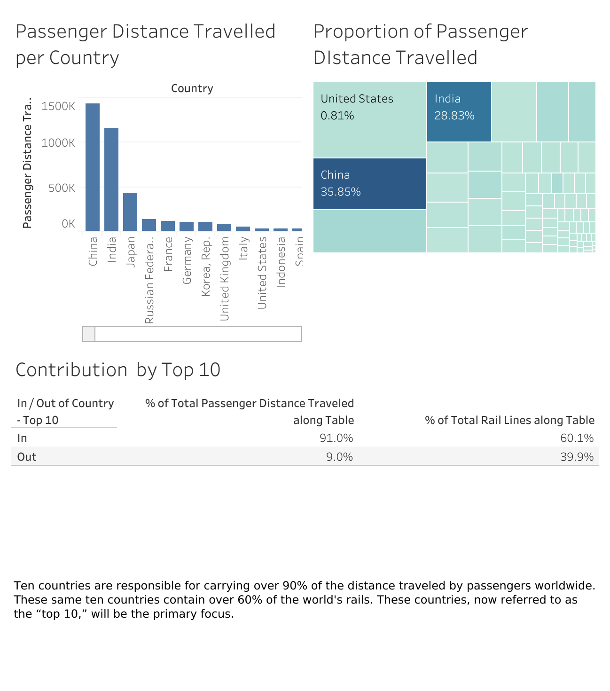

# Project-Railway-Travel-Company
The final course project for Tableau Business Intelligence Analyst Specialization

## Project Overview

This project focuses on analyzing multiple countries to determine the best location for establishing a new rail travel company. The analysis evaluates factors such as passenger volume, rail infrastructure, economic stability, business environment, geographic advantages, and tourism appeal.

The goal is to identify the country that presents the most promising opportunities for launching and expanding a rail travel business.

Data Sources

The analysis was performed using the dataset provided in the course, which is uploaded to this project.

Methodology

	1.	Passenger Volume Analysis: Examined the number of passengers using the rail networks in each country to assess potential market demand.
	2.	Rail Infrastructure Evaluation: Studied the length and quality of rail lines in each region to ensure sufficient infrastructure exists or can be easily expanded.
	3.	Economic Environment Review: Investigated each country’s GDP, business policies, and ease of doing business to identify a stable and supportive environment for company growth.
	4.	Geographic Location: Assessed the potential for international expansion by evaluating neighboring countries and cross-border travel demand.
	5.	Tourism Appeal: Reviewed international tourism trends, focusing on countries with the highest visitor numbers to determine their potential as key markets for rail travel.

Tools and Technologies

	•	Tableau: For data visualization and generating key insights from the data.
	•	Excel: For initial exploration and data aggregation.

Conclusion

After a thorough analysis, France emerges as the top pick. It stands out in passenger volume and extensive rail lines, striking a perfect balance with its robust economy and business-friendly environment. Its geographic location offers potential for international expansion, notably with promising neighboring countries. Moreover, France’s exceptional tourist appeal, leading in visitor inflow, presents a lucrative market for rail travel.

These combined factors make France the most promising country for establishing the new rail travel company.

Next Steps

	•	Conduct a deeper feasibility study specific to the French market.
	•	Investigate regulatory and legal aspects of launching a rail company in France.
	•	Explore potential partnerships with existing rail operators in France and neighboring countries.
	•	Develop a marketing strategy aimed at leveraging France’s tourism industry to promote rail travel.